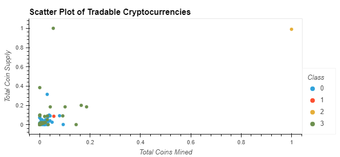
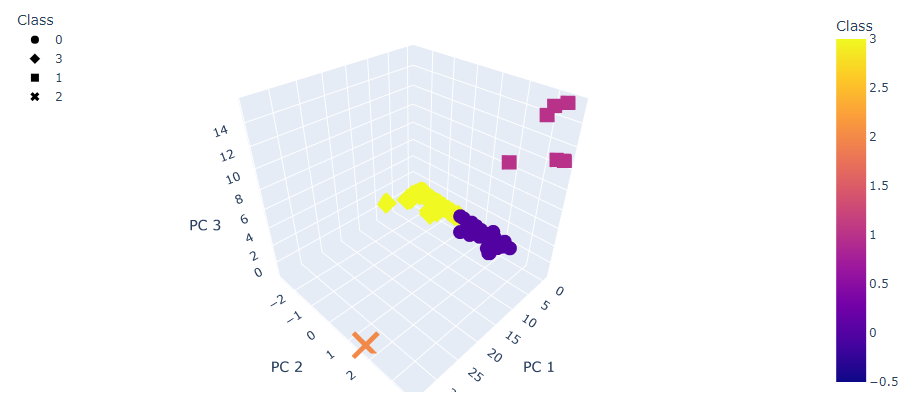

# Cryptocurrencies

# Cryptocurrencies Clustering

This repository contains the code and data for clustering and visualizing cryptocurrencies using K-means algorithm and principal component analysis (PCA). The purpose of this project is to identify and categorize cryptocurrencies based on their features and explore patterns in the data.

## Data Preprocessing (Deliverable 1)

- Loaded the cryptocurrency dataset and filtered out non-traded cryptocurrencies.
- Removed unnecessary columns and dropped rows with missing values.
- Kept only the rows where coins are mined.
- Created a new DataFrame to store the names of the cryptocurrencies.
- Applied one-hot encoding (pd.get_dummies()) to categorical features and standardized the data using StandardScaler.

## Dimensionality Reduction Using PCA (Deliverable 2)

- Applied PCA to reduce the dimensionality of the dataset to three principal components.
- Created a new DataFrame to hold the three principal components.
- Retained the index from the original DataFrame.

## Clustering Cryptocurrencies Using K-means (Deliverable 3)

- Utilized the elbow curve method to determine the optimal number of clusters.
- Implemented the K-means algorithm with the chosen number of clusters.
- Assigned cluster labels to the data points.
- Combined the original DataFrame, principal components DataFrame, coin names, and cluster labels into a new DataFrame.

## Visualizing Cryptocurrencies Results (Deliverable 4)

- Created a 3D scatter plot to visualize the clusters using the three principal components.
- Plotted the cryptocurrencies with different colors and symbols based on their assigned clusters.
- Generated a table of tradable cryptocurrencies and their features.
- Created a 2D scatter plot to show the relationship between total coins mined and total coin supply, grouped by clusters.

## Scatter Plot of Tradable Cryptocurrencies (2D)

## 3D Scatter Plot with Clusters

